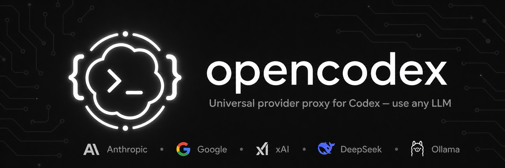
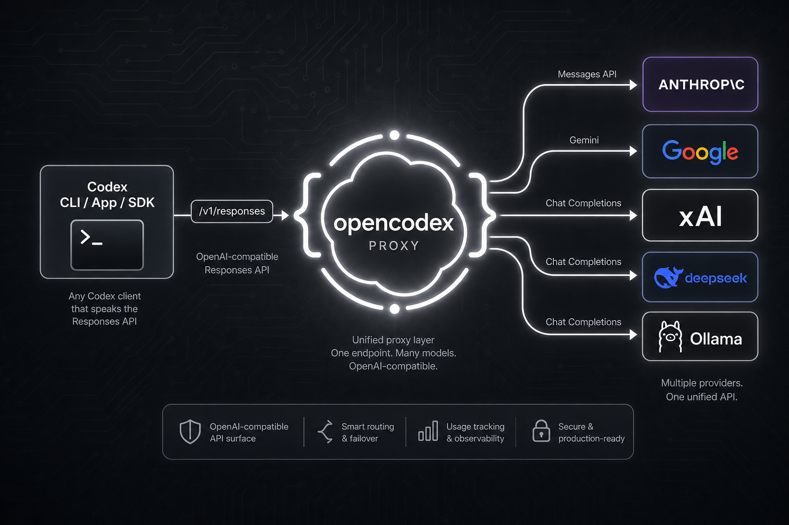

<p align="center">
  
</p>

<p align="center">
  <a href="README.md">English</a> · <a href="README.ko.md">한국어</a> · <a href="README.zh-CN.md">简体中文</a> · 📖 <a href="https://lidge-jun.github.io/opencodex/"><b>Full documentation →</b></a>
</p>

<p align="center">
  
</p>

Codex only speaks the Responses API (`/v1/responses`). opencodex sits between Codex and your LLM
provider, translating the protocol on the fly — streaming, tool calls, reasoning, and images included
— in both directions.

```
Codex CLI / App / SDK ──/v1/responses──▶ opencodex ──▶ Any provider
                                              │
              Anthropic · Google · xAI · Kimi · Ollama Cloud · Groq
              OpenRouter · Azure · DeepSeek · GLM · …and OpenAI itself
```

## Supported platforms

| OS | Status | Service manager |
|---|---|---|
| macOS (arm64 / x64) | Fully supported | launchd |
| Linux (x64 / arm64) | Fully supported | systemd (user unit) |
| Windows (x64) | Fully supported | Task Scheduler |

Requires [Bun](https://bun.sh) 1.1+. All three platforms work natively (no WSL needed on Windows).

## Quick start

```bash
# Install
npm install -g @bitkyc08/opencodex      # or: bun install -g @bitkyc08/opencodex

# Interactive setup (writes config + injects into Codex)
ocx init

# Start the proxy
ocx start

# Use Codex normally — it now routes through opencodex
codex "Write a hello world in Rust"
```

<details>
<summary><b>Don't have <a href="https://bun.sh">bun</a>?</b> — install it first (opencodex runs on bun)</summary>

<br/>

```bash
# macOS / Linux / WSL
curl -fsSL https://bun.sh/install | bash

# Windows (PowerShell)
powershell -c "irm bun.sh/install.ps1 | iex"
```

Then re-run `npm install -g @bitkyc08/opencodex`. (The `ocx` binary is bun-native, so bun must be on your `PATH`.)

</details>

Target a specific routed model with the `provider/model` form:

```bash
codex -m "anthropic/claude-opus-4-8" "Explain this stack trace"
codex -m "ollama-cloud/glm-5.2"      "Write a SQL migration"
```

## Highlights

- **Five adapters** cover Anthropic Messages, Google Gemini, Azure, the OpenAI Responses passthrough,
  and **every OpenAI-compatible Chat Completions** endpoint.
- **OAuth, API key, or ChatGPT forward.** Log in with your xAI / Anthropic / Kimi account (tokens
  auto-refresh), forward your `codex login`, or paste a key (`${ENV_VARS}` supported). An 18-provider
  API-key catalog (incl. **Ollama Cloud**) is built in.
- **Drops into Codex CLI, TUI, App, and SDK.** Injects a `[model_providers.opencodex]` table into
  `$CODEX_HOME/config.toml` (default `~/.codex/config.toml`) and writes a shared Codex model catalog
  so routed models appear in Codex model pickers.
- **Subagent control.** Feature up to five routed or native models in Codex's `spawn_agent` picker
  from `subagentModels` or the web dashboard.
- **HTTP/SSE by default, WebSocket opt-in.** The proxy has a Responses WebSocket endpoint, but it
  only advertises `supports_websockets` when `"websockets": true` is set.
- **Sidecars.** Give non-OpenAI models real **web search** and **image understanding** via a
  `gpt-5.4-mini` over your ChatGPT login.
- **Web dashboard** for providers, OAuth login, model selection, and request logs.

## Providers & adapters

| Provider | Adapter | Auth |
|---|---|---|
| OpenAI (ChatGPT login) | `openai-responses` | forward (no key) |
| OpenAI (API key) | `openai-responses` | key |
| Anthropic Claude | `anthropic` | oauth / key |
| xAI Grok | `openai-chat` | oauth / key |
| Kimi (Moonshot) | `openai-chat` | oauth / key |
| Google Gemini | `google` | key |
| Azure OpenAI | `azure` | key |
| Ollama Cloud + 17-provider catalog | `openai-chat` | key |
| Ollama / vLLM / LM Studio (local) | `openai-chat` | key (usually blank) |
| Any OpenAI-compatible endpoint | `openai-chat` | key |

## CLI

```bash
ocx init                       # interactive setup
ocx start [--port 10100]       # start the proxy
ocx stop                       # stop + restore native Codex
ocx restore                    # restore without stopping (alias: ocx eject)
ocx sync                       # refresh models + re-inject into Codex
ocx status                     # is the proxy running?
ocx login <xai|anthropic|kimi> # OAuth login
ocx logout <provider>          # remove a stored login
ocx gui                        # open the web dashboard
ocx service <install|start|stop|status|uninstall>   # background service (launchd/systemd/schtasks)
ocx update                     # update opencodex to the latest published version
```

## Configuration

Config lives at `~/.opencodex/config.json`. Minimal example:

```json
{
  "port": 10100,
  "defaultProvider": "anthropic",
  "providers": {
    "anthropic": {
      "adapter": "anthropic",
      "baseUrl": "https://api.anthropic.com",
      "authMode": "oauth",
      "defaultModel": "claude-sonnet-4-6"
    },
    "ollama-cloud": {
      "adapter": "openai-chat",
      "baseUrl": "https://ollama.com/v1",
      "apiKey": "${OLLAMA_API_KEY}",
      "defaultModel": "glm-5.2"
    }
  }
}
```

WebSocket transport is off by default. Set `"websockets": true` only if you want Codex to advertise
and use the Responses WebSocket path instead of HTTP/SSE.

See the **[Configuration reference](https://lidge-jun.github.io/opencodex/reference/configuration/)**
for every field.

## Documentation

The public docs — install, providers, routing, sidecars, Codex integration, Codex App model picker,
and CLI/config reference — are built from [`docs-site/`](./docs-site) and published to
**[lidge-jun.github.io/opencodex](https://lidge-jun.github.io/opencodex/)**.

Maintainer source-of-truth notes live under [`structure/`](./structure). Historical investigations
remain under [`docs/`](./docs).

## Development

```bash
git clone https://github.com/lidge-jun/opencodex.git
cd opencodex
bun install
bun run dev          # start the proxy in dev mode
bun x tsc --noEmit   # typecheck
```

See **[Contributing](https://lidge-jun.github.io/opencodex/contributing/)**.

## License

MIT
