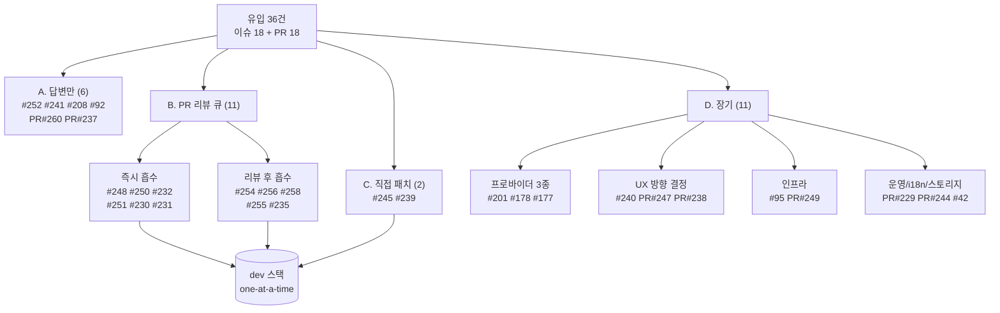

# 003 — 최종 액션 분할: 답변만 / 단기 / 장기 (2026-07-22 14:36 KST)

이슈 18 + PR 18 = 36건을 실행 단위로 재편. 실행은 별도 지시 후 one-at-a-time.

## A. 답변만 하면 끝 (코멘트/클로즈/retarget — 코드 없음, 6건)

| 대상 | 액션 |
|---|---|
| 이슈 #252 | upstream 플레이스홀더 표시 의미론 설명 코멘트 → 클로즈 |
| 이슈 #241 | Codex Desktop 원격 allowlist(upstream) 책임 설명 → 클로즈 또는 upstream-tracking 라벨 |
| 이슈 #208 | 요구 계약 상세 요청 코멘트 → 무응답 시 클로즈 |
| 이슈 #92 | upstream client ciphertext 한계 + V1 우회 안내 재확인 → upstream-tracking 유지 |
| PR #260 | dev retarget + draft 해제 안내 코멘트 |
| PR #237 | #256 채택 결정 시 사유 코멘트 후 클로즈 |

## B. 단기 — PR 리뷰 큐 (이미 패치 존재, 리뷰→흡수, 11건)

즉시 흡수 트랙 (SMALL-SAFE): #248(→이슈 #234) → #250(→#228) → #232 → #251 → #230 → #231

리뷰 후 흡수 트랙 (NEEDS-REVIEW): #254(→#253) → #256(→#246, #237 클로즈 동반) → #258(→#257, CI 빨강 해소 선행) → #255 → #235

## C. 단기 — 직접 패치 필요 (PR 없음, 2건)

| 이슈 | 내용 | 규모 |
|---|---|---|
| #245 | Cursor 툴 턴 usage checkpoint carry-forward 누락 → context 100% 고정 | 소형 (기존 `260722_issue_bug_sweep` R 클러스터 인접) |
| #239 | GUI 409 경로에 OAuth flow cancel 도선 부재 | 소형 (flow ID 노출 + cancel 버튼) |

## D. 장기 프로젝트 (별도 devlog 유닛 필요, 11건)

| 묶음 | 대상 | 성격 |
|---|---|---|
| 프로바이더 신규 | 이슈 #201(TRAE) #178(Factory) #177(Warp) | 각각 upstream auth/실행 계약 확보가 선결 — 개별 타당성 판단 |
| 계정/UX | 이슈 #240(계정 별칭), PR #247(통합 프로바이더 UI), PR #238(combo rename) | Providers/Accounts UX 방향 결정이 공통 선결 |
| 인프라/배포 | 이슈 #95(멀티유저 proxy), PR #249(Cloudflare Tunnel) | 보안 경계·테넌시 설계 필요 |
| 운영 자동화 | PR #229(issue intake 개편) | 라벨 선생성 + 정책 staged 리뷰 |
| i18n | PR #244(일본어) | 번역 QA + locale parity 별도 사이클 |
| 스토리지 | 이슈 #42(cleanup Phase 2+) | 고위험 lifecycle — 기존 `500_storage-page-session-cleanup` 유닛 연계 |

## 전체 흐름도

## 결정 대기 (HITL)

1. #256 vs #237 — adaptive-thinking 정책 (32k headroom vs 128k 기본값)
2. #247 채택 여부 — Providers UI 방향 (채택 시 #255/#231 처리 방식 변경)
3. REPLY-ONLY 클로즈 코멘트 실제 발사 승인
