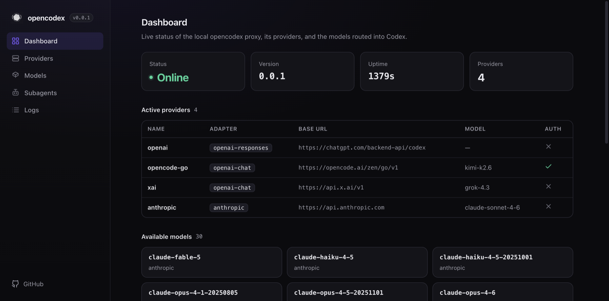

import { Card, CardGrid, LinkCard } from '@astrojs/starlight/components';

**opencodex** (`ocx`) is a local proxy that sits between [OpenAI Codex](https://openai.com/codex)
and any LLM provider. Codex only speaks the **Responses API** (`/v1/responses`); opencodex translates
that protocol — in both directions, including streaming, tool calls, reasoning, and images — into
whatever wire format your provider expects, then translates the answer back.

```
Codex CLI / App / SDK ──/v1/responses──▶ opencodex ──▶ Any provider
                                              │
                  Anthropic · Google · xAI · Kimi · Ollama Cloud · Groq
                  OpenRouter · Azure · DeepSeek · GLM · …and OpenAI itself
```



<CardGrid stagger>
  <Card title="Any provider" icon="puzzle">
    Five adapters cover Anthropic Messages, Google Gemini, Azure, the OpenAI Responses passthrough,
    and **every OpenAI-compatible Chat Completions** endpoint — plus an 18-provider API-key catalog.
  </Card>
  <Card title="OAuth or API key" icon="approve-check">
    Log in with your xAI, Anthropic, or Kimi account (OAuth, auto-refreshed), forward your ChatGPT
    login, or paste an API key. Keys can be `${ENV_VARS}`.
  </Card>
  <Card title="Drops into Codex" icon="rocket">
    `ocx init` injects a provider into `~/.codex/config.toml` and merges routed models into Codex's
    catalog and subagent picker. `ocx stop` restores native Codex cleanly.
  </Card>
  <Card title="Sidecars" icon="magnifier">
    Give non-OpenAI models real **web search** and **image understanding** by routing those
    capabilities through a `gpt-5.4-mini` sidecar over your ChatGPT login.
  </Card>
</CardGrid>

## Quick start

```bash
# Install
bun install -g opencodex      # or: npm install -g opencodex

# Interactive setup (writes config + injects into Codex)
ocx init

# Start the proxy
ocx start

# Use Codex normally — it now routes through opencodex
codex "Write a hello world in Rust"
```

## Where to next

<CardGrid>
  <LinkCard title="Installation" href="/opencodex/getting-started/installation/" description="Install ocx, prerequisites, and verification." />
  <LinkCard title="How It Works" href="/opencodex/getting-started/how-it-works/" description="The full request lifecycle: parse → route → adapter → bridge → SSE." />
  <LinkCard title="Providers" href="/opencodex/guides/providers/" description="OAuth, API-key catalog, forward/passthrough, and the full provider table." />
  <LinkCard title="CLI Reference" href="/opencodex/reference/cli/" description="Every ocx command and flag." />
</CardGrid>
